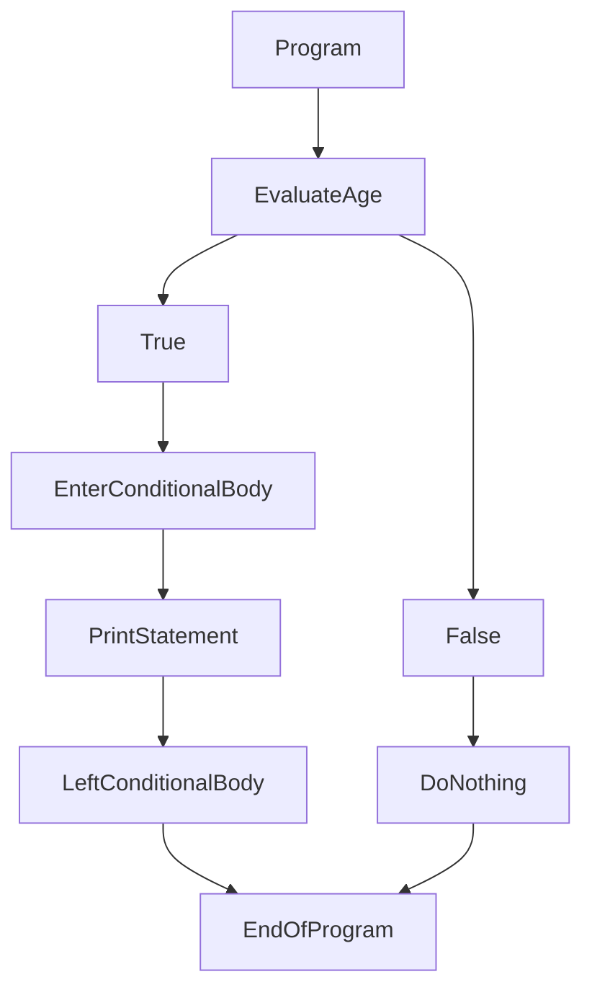
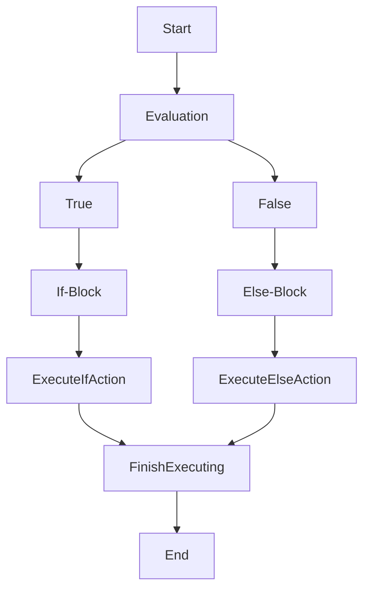

# Control Flow

## Conditionals
Kotlin provides `if` and `when` for checking conditional expressions.

Kotlin `flow control statements` determine the next statement to be executed. For example, the statements if-else, if, 
when, while, for, and do are flow control statements.

Control flows are used to handle the different possibilities during runtime. The body of the control flow statements
determine the actions *if* the expression is evaluated as true.

!!! example "Example of Control Flow"
    === "Kotlin"
    ```kotlin
    fun main() {
        //sampleStart
        val ageOfJohn: Int = 20
        val ageOfBrad: Int = 21
        
        if (ageOfJohn < ageOfBrad) {
            println("The age of John is $ageOfJohn, and the age of Brad is $ageOfBrad, \ntherefore, John is younger than Brad.")
        }
        //sampleEnd
    }
    ```

`Explanation:` In this simple program, we initialized two variables of type integer. The two integer variables store the 
               integer *20*, and *21*, representing the age of two people - John and Brad. We then evaluated the two ages 
               using an if statement. 

***Consider the following flowchart:***



`Explanation of diagram:` This particular flowchart represents our simple program. As the program executes, it enters our 
                          conditional statement. If the expression `(ageOfJohn < ageOfBrad)` or `(20 < 21)` evaluates to 
                          true, it enters our statement body and prints out the statement. But if it evaluates to false, it leaves
                          the conditional statement and ends.

`Conditionals:` As shown, conditionals can be very helpful when it comes to the evaluations of expressions, and how we
                can implement different actions based on their boolean evaluations. 
                

### `if` Statements
'if' statement is used to execute the block of code when the condition becomes true.

`Connection:` Similar to what was shown on the previous topic, an if statement will execute if the evaluated expression becomes
              true, but does nothing when it is evaluated to false. Consider the following programs:

!!! example "Example 1"
    === "Kotlin"
    ```kotlin
    fun main() {
        //sampleStart
        val small: Int = 1
        val big: Int = 2
        
        if(small < big) println("$small is smaller than $big!")
        
        if(small > big) println("$small is not bigger than $big!")
        //sampleEnd
    }
    ```

!!! example "Example 2 -> `==` operator checks if two contents are ***equal***"
    === "Kotlin"
    ```kotlin
    fun main() {
        //sampleStart
        val numOne: Double = 2.2
        val numTwo: Double = 2.2
        
        if(numOne == numTwo) println("$numOne is equal or = to $numTwo!")
        
        if(numOne > numTwo) println("$numOne is NOT greater than $numTwo!")
        //sampleEnd
    }
    ```

!!! example "Example 3 -> `<= || >=` is `greater/less than or equal to`"
    === "Kotlin"
    ```kotlin
    fun main() {
        //sampleStart
        val numOne: Int = 1
        val numTwo: Int = 2
        val numThree: Int = 2
        
        // evaluates to true because numOne is less than numTwo
        if(numOne <= numTwo) println("$numOne is less than or equal to $numTwo!")
        
        // evaluates to true because numThree is equal to numTwo
        if(numThree >= numTwo) println("$numThree is greater than or equal to $numTwo")
        //sampleEnd
    }
    ```

!!! example "Example 4 -> `! operator` -> `!=` is ***not equal to***"
    === "Kotlin"
    ```kotlin
    fun main() {
        //sampleStart
        val numOne: Int = 1
        val numTwo: Int = 2
        
        // evaluates to true because numOne does not equal to numTwo
        if(numOne != numTwo) println("$numOne DOES NOT equal to $numTwo")
        //sampleEnd
    }
    ```

### `if-else`
`if-else` statements are very similar to if-statements, only with an additional else. Consider the following ***flowchart:***



!!! example "Example of `If-Else`"
    === "Kotlin"
    ```kotlin
    fun main() {
        //sampleStart
        val numOne: Int = 1
        val numTwo: Int = 2
        
        if(numOne > numTwo) {
            println("If-Block: $numOne is NOT greater than $numTwo!")
        } else {
            println("Else-Block: $numTwo is greater than $numOne!")
        }
        //sampleEnd
    }
    ```

`Explanation:` Inside the program above, we initialized two variables of type integer. Within our if-else blocks,
               the if-block will not execute because it will be evaluated to false since 1 is not greater than 2.
               Once the if-block evaluates to false, the else-block is executed.

`Else:` The contents within the else block will execute if the if-block is evaluated as false.

!!! example "Example 2 -> `length` returns the length of a string"
    === "Kotlin"
    ```kotlin
    fun main() {
        //sampleStart
        val dog: String = "dog"
        val dinosaur: String = "dinosaur"
        
        if(dog.length > dinosaur.length) println("dogs are bigger than dinosaurs!")
        else println("dinosaurs are bigger than dogs!")
        //sampleEnd
    }
    ```

`Why if-else?:` We use if-else blocks to execute another block of code when the if-block evaluates to false. 
                Consider the following code as an example:

!!! example "Example program"
    === "Kotlin"
    ```kotlin
    fun main() {
        //sampleStart
        val BradSignedIn: Boolean = false
        
        if(BradSignedIn) println("Welcome!")
        else println("Please sign in first, Brad!")
        //sampleEnd
    }
    ```

`Explanation:` Since there are only two possibilities, signed-in or not signed-in, we can create a simple if-else
               to check for the user's sign-in status.
### 'when' Statements
`When` defines a conditional expression with multiple branches. It is similar to the switch statement in C-like languages. 
Its simple form looks like this:

!!! example "Example of when statement"
    === "Kotlin'
    ```kotlin
    fun main() {
        //sampleStart
        val x: Int = 2
        when(x) {
            1 -> print("x = 1")
            2 -> print("x = 2")
            else -> {
                print("x is neither 1 nor 2")
            }
        }
    //sampleEnd
    }
    ```

`Explanation:` When statements can be seen as a combination of multiple if-statements and a else-statement.
               The syntax when(x) means that we are operating the when-statement on the variable x. Inside the 
               when block, if x == 1, we do an action, if x == 2, we do an action, and finally, we do something else
               when x != 1 nor 2.