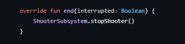

# Functions

## What are Functions?

In programming, functions allow us to repeat a sequence of code without
having to write the code over again. This allows us to simplify a complex action
by using only one command. In FRC, this command can be moving a robot's arm, where a required
sequence of commands are encapsulated within one command or function. Functions also help us by 
simplifying our code, allowing our code to be more understandable and reusable.

### Declaring a Function in Kotlin

In Kotlin, functions are declared using the `fun` keyword:

!!! example "Example of a Function"
    === "Kotlin"
    ```kotlin
    fun main() {
        //sampleStart
        fun exampleFunction() {
            print("Hello from example function")
        }
        //sampleEnd
    }
    ```

`Explanation:` By starting our line with the `fun` keyword, we are telling
Kotlin that we would like to create a new function. Following the `fun` keyword
will be the name of our function, then followed by a pair of parentheses. After the declaration
of our function, we now specify the scope of the function by enclosing the code in a pair of 
brackets. 

Example Function:



`Explanation:` Here is a simple example of a function called end. When this function
is invoked (called), we will invoke the function inside our ShooterSubsystem singleton class to
stop the shooter on our robot.

### Using Functions

Now we understand the process of declaring functions, how do we actually use them? The process
of using a function is called `invoking a function`, or `calling a function`.
To call a function, we will need to reference the name of the function followed
by a pair of parentheses:

!!! example "Example of a Function"
    === "Kotlin"
    ```kotlin
    fun main() {
        //sampleStart
        fun exampleFunction() {
            print("Hello from example function")
        }
        exampleFunction()
        //sampleEnd
    }
    ```

### Arguments & Parameters

Functions in programming are very similar to functions in mathematics because they both have an input and an output. 
In programming, the inputs of a function are called `arguments`, and their corresponding outputs are the return types. 
To produce outputs from a function, arguments and parameters are very important. The argument can be thought of as a 
value assigned to a temporary variable within the function, and parameters act as that temporary variable, meaning that 
the values of the parameters will be set to the values of the arguments at the time the function is invoked (most of the time).

???+ tip "Arguments and Parameters"
    === "Kotlin"
    ```kotlin
    fun main() {
        //sampleStart
        fun exampleFunction(x: Int) {
            print(x * 2)
        }
        val value: Int = 10
        exampleFunction(value)
        //sampleEnd
    }
    ```

`Explanation:` The coded started with a function declaration, but this time, a few more things
are added in there. Our parameter is the integer variable `x` (x: Int) and our argument
is the non-mutable integer called value. `value` becomes the argument when it is passed
into the exampleFunction inside the pair of parentheses; then, the value inside `value` is copied 
into our variable `x`, allowing us to perform with the value inside `value`. 

***Execution Flow***

1. Creates immutable integer variable called `value` with the value of 10
2. exampleFunction is called and `value` is passed into the function as the argument
3. exampleFunction receives the call and **local** variable `x` copies the value of variable `value`
4. `x` is now 10

!!! tip
    The variable `x` is only accessible within exampleFunction, and not anywhere else.
    This is because `x` is only within the scope of the function, `x` is not **global**

### Return Types

Remember how a programming function is similar to a math function? Functions in kotlin can also have outputs,
often known as `returns`, and those returns will always have a return type. Let's become more familiar with functions
and their returns:

!!! example "Example of a Function "return""
    === "Kotlin"
    ```kotlin
        fun main() {
        //sampleStart
        fun exampleFunction(x: Int): Int {
            return x * 2
        }
        val value: Int = 10
        val returnedValue = exampleFunction(value)
        print(returnedValue)
        //sampleEnd
    }
    ```

`Explanation:` In the code above, the exampleFunction now has one more added component to it - the return type. 
The return type of the exampleFunction will be an `Int`, and you might question, what are some other return types? 
There are many possible return types a function can have in Kotlin: Int, Boolean, List, and custom objects that you create. 
However, a function can only have `one` return type. In the example, the variable `value` is passed into the exampleFunction, 
and the exampleFunction returns an integer value of x * 2. This value is now stored in the variable `returnedValue`.

!!! tip
    In Kotlin, it is also possible to return multiple values using data classes or Pair and Triple, but technically, 
    these are still single return types because they are a single object that contains multiple values..

!!! example "Boolean Return"
    === "Kotlin"
    ```kotlin
        fun main() {
        //sampleStart
        fun exampleFunction(x: Double): Boolean {
            if (x > 19.9) {
                return true
            }
            return false
        }
        val valueOne = 20.0
        val valueTwo = 19.89
        println(exampleFunction(valueOne))
        println(exampleFunction(valueTwo))
        //sampleEnd
    }
    ```


