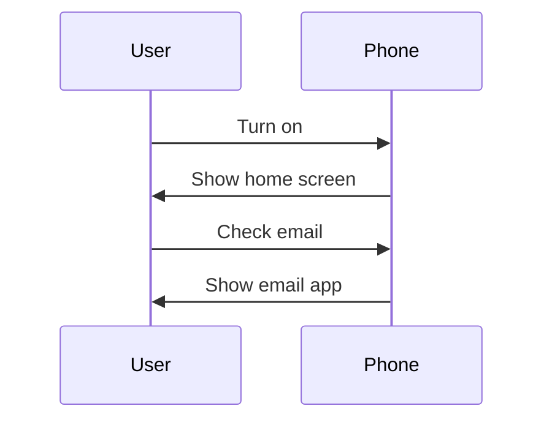

# Introduction to Programming

## Computational Processes
Anytime you turn on your phone, open an app, or check your email - your computer launches this abstract idea of a *computational process*. Essentially, a computational process is a series of steps that a computer takes to complete a task.
These simple processes can later evolve to become more complex, and eventually becoming the programs that we use every day.

The next step is to *tell* our computer to complete a computational process. This is where programming languages come in.

## Programming Languages
Programming languages are a set of rules that allow us to tell our computer to complete a computational process. 

Typically, good programming languages are designed to by easy to **read and write**, in such a way to be easy to understand by both humans and computers.

### Common Features
While programming languages may differ in syntax, they typically share a common set of features:

- Expressions: A combination of values, variables, operators - the simplest forms of programming.
- Combinations: Takes expressions and combines them to form more complex expressions.
- Abstractions: Allows us to name, modify, and interact with complex expressions.

!!! question "What's the best programming language?"
    There is no "best" programming language. Each programming language typically has its own set of strengths and weaknesses - some are better for certain tasks than others.
    
    As you gain more experience with programing, you'll realize that it's not about the language, but rather the concepts and ideas that you learn. Picking up new languages becomes easier - it's just a matter of learning the syntax.

    That being said, there's no reason to start with a "hard" language. We recommend starting with a language that is easy to learn - such as Python or Java, and then moving on to more complex languages.

## Abstractions
Abstraction is a way of simplifying something by removing unnecessary details. 

In computer science, abstraction is used to make complex programs easier to understand and use. For example, when you open a file on your computer, you don't need to know how the file is actually stored on your hard drive. You just need to know that you can open it and read its contents.

Abstraction is used in many different ways in computer science. Mastering abstraction is an important part of learning how to program.

!!! example
    Imagine that you are driving a car. You don't need to know how the engine works in order to drive the car. You just need to know how to use the controls. The details of how the engine works are hidden from you, which allows you to focus on the essential features of driving the car.

    In this example, we would say the hardware of the car is "abstracted" away from you.

In the same way, abstraction in computer science allows you to focus on the essential features of a program, without having to worry about the details of how the program is implemented. This makes programs easier to understand and use.

As you learn more about programming, you'll learn about different types of abstractions, such as functions, classes, objects, and data structures.

To end this section, here's a quote from [Linus Torvalds](https://en.wikipedia.org/wiki/Linus_Torvalds), the creator of Linux:
!!! quote
    "Bad programmers worry about the code. Good programmers worry about data structures and their relationships."

Being able to master abstractions is one of the most important skills in programming.