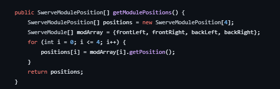

# Loops

## What are they?

*Loops* in any programming languages are the foundations when we are working 
with arrays, lists, and the elements stored inside them. A traditional loop will always have
a `starting point` and an `ending point`. Loops are handy because they save time, reduce errors, and they make code more
readable.

## For loops

For loops are commonly used when we want to *loop through* an array and access the elements
within them; this works with any collection interface that inherits the iterable interface.

!!! example "*`Kotlin For Loop`*"

    === "Kotlin"
        ```kotlin
        fun main() {
        //sampleStart
            val listOfColors = listOf<String>("Red", "Blue", "Orange", "Yellow")
            for (x in listOfColors) {
                println(x)
            }
        //sampleEnd
        }
        ```

`Explanation:` Inside our sample program, we declared an immutable list of strings and stored four colors within it. 
We declared our for loop with the syntax: *for(x in ...)*. This means that for every **x** that is inside our list, we will 
perform the action of printing **x**. **x** represents the elements within our list, and it will continue to move on to the next 
element as our loop continues. For example, the first time the loop executes, **x** will be "Red"; the second time, it will 
be "Blue"; and it will stop when it reaches "Yellow", which is the last element within the list.

`For Loops in Robotics:` For loops are quite common in robotics programming because arrays and lists store information, 
and loops are necessary to access individual elements in a precise and understandable manner.

For example:



`Explanation:` Don't let all of that Java code confuse you! All we will be taking a look at is a SwerveModulePosition array called 
*positions* that will be holding the positions of the four swerve modules. In the traditional for loop, we will start at 
0 and end at 4. The operation is that we will be storing the position information into our newly created SwerveModulePosition 
array. This is a fantastic example of a for loop in action because it shows us how accessing and storing information can be 
done within a few lines of code.

`Here are some more examples with for loops!:`

!!! example "*`Range Expression inside For Loops`*"

    === "Kotlin"
        ```kotlin
        fun main() {
        //sampleStart
            val numOne = 10
            val numTwo = 20
            for (x in numOne..numTwo) {
                println(x)
            }
        //sampleEnd
        }
        ```

!!! example "*`"withIndex" in For Loops`*"

    === "Kotlin"
        ```kotlin
        fun main() {
        //sampleStart
            val myArray = arrayOf("Hi", "Hello", "Hey")
            for ((index, value) in myArray.withIndex()) {
                println("The element $value is at index $index")
            }
        //sampleEnd
        }
        ```

`Explanation:` There are a lot of things that we can add into a for loop, just like the *withIndex* keyword.
This way of manipulating a for loop allows us to not only have access to the value, but also access to the index of the current element
that we are looping through.

## While Loops

While loops are very similar to for loops in the way that they all loop through a collection. A for loop will stop once
it reaches the end of the collection; However, a while loop will continue as long as a specified condition is reached. 

!!! example "*`Kotlin While Loop`*"

    === "Kotlin"
        ```kotlin
        fun main() {
        //sampleStart
            var i = 0
            while(i < 5) {
                println(i)
                i++;
            }
        //sampleEnd
        }
        ```

`Explanation:` In this example code fragment, we initialized a mutable integer variable *i* to the value 0. 
In our **while loop condition**, we established that the loop will continue to run as long as the value of i is
less than 5; if it is, we will print out the current value of i and increment i by 1.
