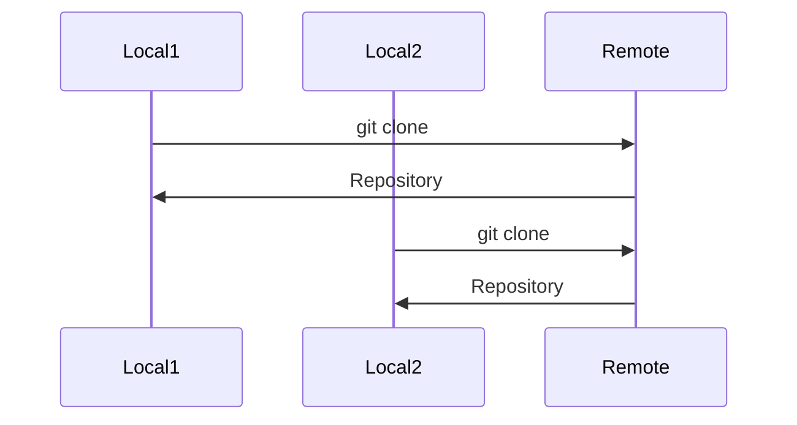
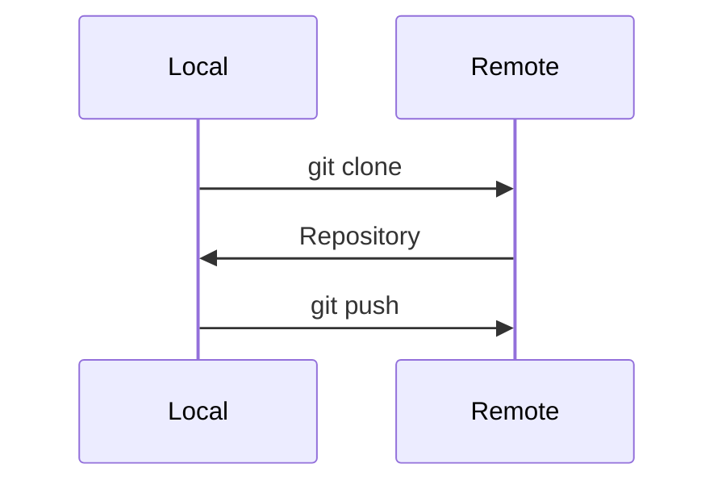
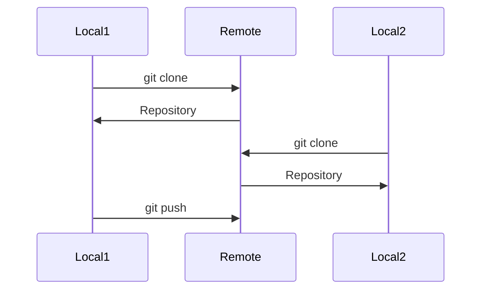
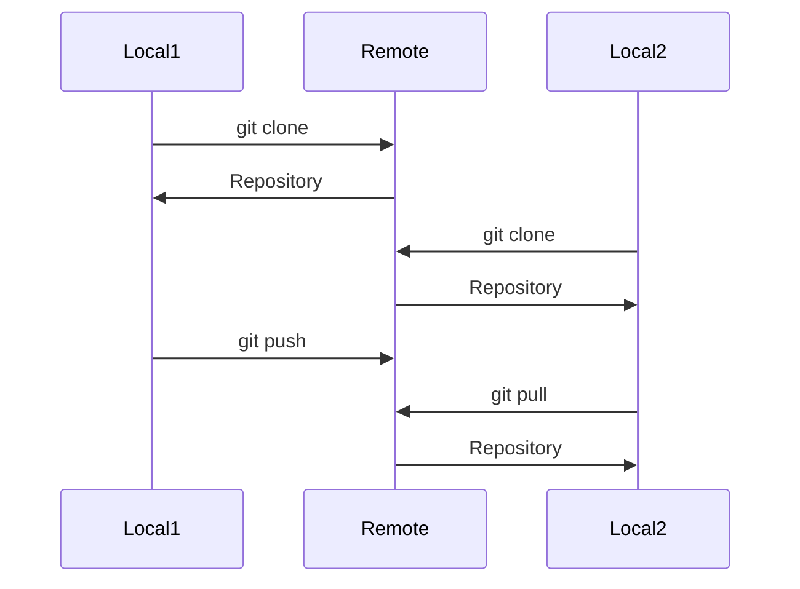
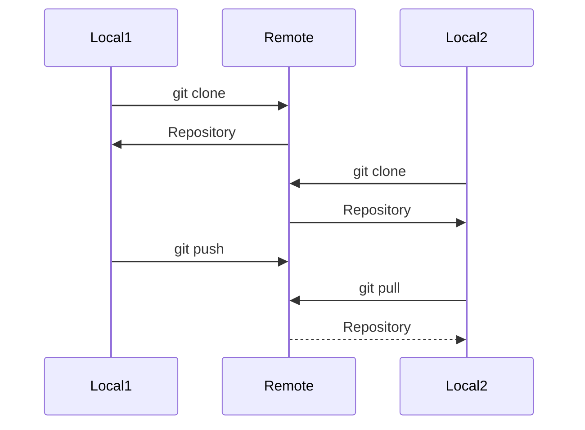
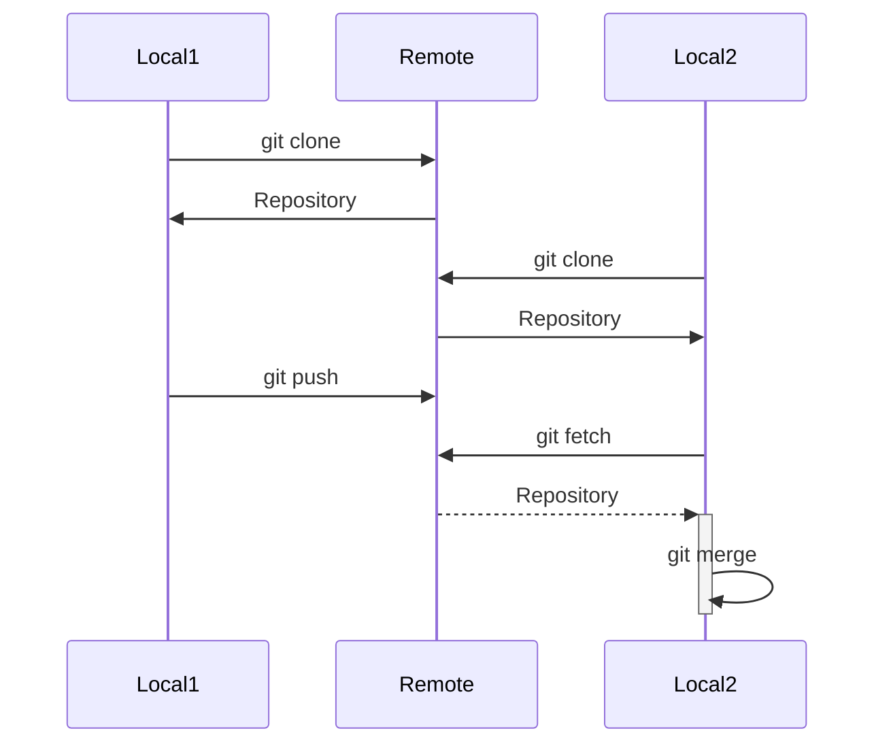
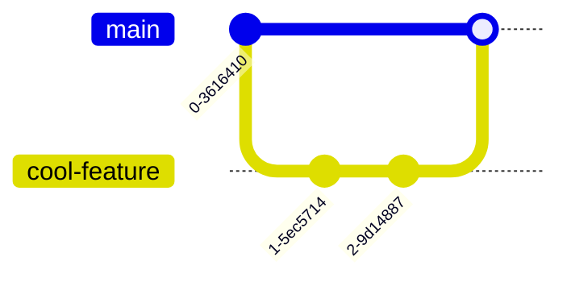

# Git In Action (Multiple Repositories)

So far, we've only been working with a single local repository. However, Git is most powerful when working with multiple repositories, especially when working with multiple people.

## Remote Repository

### Identifying the Problem
Let's say I had a project on my computer, and I wanted to share it with someone else. I could send them the files, but what if I wanted to work on the project with them? I could send them the files, and then they could send me the files back, but that would be a pain to manage.
??? question "What are other potential issues?"
    Another issue here is that we wouldn't be able to work on the project at the same time without knowing what exactly changed. This leads to potential conflicts that could ultimately break code. It doesn't work at scale, and it's inefficient.

### Incorporating Git

What if we had a central repository that we could both access? That way, we could both work on the project, and we could both see the changes that the other person made.

This is where a remote repository comes in. A remote repository is a repository that is stored on a server, and can be accessed by multiple people. This allows multiple people to work on the same project, and see the changes that the other person made.
We'll touch more about how we're actually syncing changes in [Pushing and Pulling](#pushing-and-pulling).

!!! info
    This is typically where Github or some other service comes in. Github is a website that allows you to host remote repositories.

## Cloning a Repository
Let's say we have a remote repository that we want to work on. We can clone the repository to our local machine, and then we can work on it locally.

### `git clone`
To clone a repository, we can use the `git clone` command. This command takes in a URL to a remote repository, and then clones it to our local machine.

```bash
git clone https://github.com/frc2204/ramdocs
```
        


!!! success
    This solves our previous issue of having to send files back and forth. Now, we can both work on the same project, and we can both see the changes that the other person made. Plus, it works at scale, $N$ people can work on the same project.
    
    Git is actually used in large scale projects, from enterprise software to open source projects like [Linux](https://github.com/torvalds/linux).

## Pushing and Pulling

Now that we have a remote repository, we can push and pull changes to and from the repository. This allows us to sync changes between multiple people.

### `git push`
To push changes to a remote repository, we can use the `git push` command. This command will take all the new commits that we have made, and push them to the remote repository.



Now let's see how this works at scale



!!! question
    `Local1` was able to push changes, but keep in mind that `Local2` isn't able to see the changes. How do we fix this?

### `git pull`
To pull changes from a remote repository, we can use the `git pull` command. This command will take all the new commits that have been pushed to the remote repository, and pull them to our local repository.

!!! warning
    This has the potential to cause conflicts. We'll talk about how to resolve these conflicts in [Resolving Conflicts](#resolving-conflicts).



!!! success
    Now, `Local2` is able to see the changes that `Local1` made. This allows us to sync changes between multiple people.

!!! info
    `git pull` is actually just a combination of `git fetch` and `git merge`. `git fetch` will fetch all the new commits from the remote repository, and `git merge` will merge them into our local repository.

#### `git fetch`
Fetches the new commits from the remote repository, but won't merge them into our local repository. This allows us to see the changes that have been made, but it doesn't change our local repository.



#### `git merge`
Merge the new commits into our local repository. This will change our local repository if no conflicts occur.



## Resolving Conflicts

When a conflict occurs, Git lets us know, and we'll have to go in and manually resolve the conflict.

!!! info
    You can use `git status` to see if there are any conflicts that need to be resolved, or abort the merge if you don't want to resolve the conflicts with `git merge --abort`.

When a conflict occurs, Git will mark the conflict in the file with `<<<<<<< HEAD`, `=======`, and `>>>>>>> ...`. You'll need to delete these elements and decide what you want to keep.

!!! example
    ```
    <<<<<<< HEAD
    This is the code that you wrote
    =======
    This is the code that the other person wrote
    >>>>>>> ...
    ```
    In this example, you'll need to decide whether you want to keep the code that you wrote, or the code that the other person wrote. Or both! It's up to you. :smile:

Once you've resolved the conflict, you'll need to commit the changes.


## Avoiding Conflicts

Conflicts are inevitable, but there are some things that you can do to avoid them.

### Branching

With branching, you can create a new branch, and work on that branch. This allows you to work on a feature without affecting the main branch. Once you're done with the feature, you can merge the branch into the main branch.

#### `git checkout`
To create a new branch, we can use the `git checkout` command. This command will create a new branch, and switch to that branch.

```bash
git checkout -b feature-branch
```




The code you change should only affect the feature you're working on, and not the main branch. This way, code remains somewhat isolated, and conflicts are less likely to occur.

!!! info
    This pattern is called [Feature Branching](https://www.atlassian.com/git/tutorials/comparing-workflows/feature-branch-workflow), and is our team's preferred workflow.

### Communication

Proper communication can help avoid conflicts. If you're working on a feature, let your teammates know. This way, they can avoid working on the same feature, and avoid conflicts.

!!! info
    The programming lead will usually delegate features to each programmer, so this shouldn't be an issue.

### Code With Me
A feature within JetBrains IDEs, Code With Me allows you to collaborate with other people on the same project. This allows you to see what the other person is doing, and avoid conflicts. It's essentially the Google Docs of programming, but for whole projects.
!!! tip
    It is highly recommended that you use Code With Me for real-time collaboration.

Congratulations! You now know the basics of Git and collaboration! :tada:
