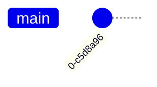
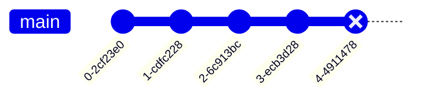

# Git In Action (Single Repository)

## Creating a Repository
To create a repository, open your terminal and run `git init` in the desired directory you want to create a repository in.

??? question "What does `git init` actually do under the hood?"
    `git init` actually a hidden folder called `.git` in the directory. This folder contains all the information about the repository, and should not be modified manually.
    You can see the contents of `.git` by enabling hidden files in your file explorer, or by running `ls -a` in your terminal.

## Adding and Committing Files
After creating your repository with `git init`, git doesn't actually know what files you want to track. Here's what git knows about your repository so far:

!!! info
    The staging area isn't actually a directory or file, it's a file within the `.git` directory. For the sake of simplicity, we'll treat it as a separate entity.

### `git add`

You can tell git about your file with `git add <filename>`. Let's say I want to tell git about `File1`, so we run `git add File1`:

Note that git adds your file to the staging area. What this means is that, **once you stage a file, git starts tracking that specific change you made to the file.**

???+ tip
    You can also use `git add .` to add all files in the current directory, or `git add -A` to add all files in the entire repository.

### `git commit`

Now let's take a snapshot of the staging area. This is called a commit, and you can create a commit with `git commit -m "<message>"`. The `-m` flag allows you to add a message to your commit, which is useful for keeping track of what changes you made.

After committing, git will no longer track changes to the file. If you make any changes to the file, you will need to stage it again before committing.

Here's what git knows about your repository now:

Notice how `.git` contains `File1`. Git has made a snapshot to remember the state of the file at the time of the commit. Additionally, the staging area is now empty.

Here's a cool tree diagram of what we've done so far (often referred to as a **commit tree**):

??? question "What's a SHA-1 hash?"
    SHA-1 is a cryptographic hash function that takes in some bytes and returns a series of bytes. What's interesting is that if you change even one byte of the input, the output will be completely different. This is useful for git because it allows us to uniquely identify commits.
    
    The SHA algorithm is also used in other cryptographic applications, such as storing your password in a database and even in Bitcoin. Learn more about hashing with this [video](https://youtu.be/bBC-nXj3Ng4).

???+ tip
    You can also use `git commit -a -m "<message>"` to automatically stage all files that have been modified, and then commit them.

## Restoring Commits

Let's say I've been working on my project for a while, and I've made a few commits. Here's what my commit tree looks like:

And here's what git knows about my repository:

Let's say I've made a change to `File2` such that it becomes `File2.1`. I'll add and commit these changes

### `git revert`

Now let's say I want to undo my changes to `File2`. You can use `git revert <commit>` to undo a commit, with `<commit>` being the commit hash (or id). Let's revert to  `Commit3`:

Here's what the commit tree looks like now:

???+ info
    There are other ways to undo commits, such as `git reset` and `git checkout`. Typically, `git revert` is the safest option, as it doesn't delete any commits, but the other two options are useful in certain situations and may be more elegant.

Congratulations! You've learned the basics of git. Now let's learn how to collaborate with others.