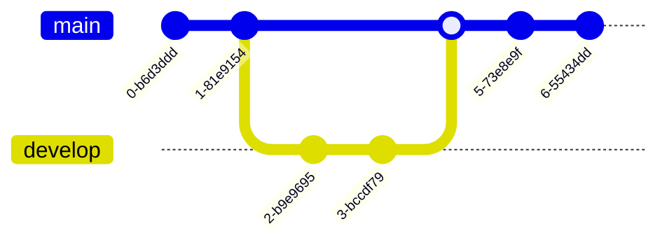

# Git Introduction

Git is a Version Control System used to manage project files. Typically, the strengths of Git are most apparent when working on a project with multiple people, but it can also be used for personal projects.

In essence, Git allows you to create “checkpoints” for your files, so you can track your progress and restore old versions.

Locally, this allows you to manage your own files and code more effectively on a single computer.

## Git Terminology

#### Repository
A repository is a collection of files and folders that are tracked by Git. Think about this basically as a project folder

#### Commit
A commit is a checkpoint or snapshot for a repository at a specific time, and contains a information about changes made, who made the changes, etc.

#### Branch
A branch is a separate version of a repository. Branches are used to develop features or make changes to a repository without affecting the any "main" version. Once the changes are complete, the branch can be merged back into the main version, or even deleted.

!!! info
    This is a simple example of how branches work. In reality, branches are much more powerful and can be used in many different ways, especially when working with multiple people.    

## Git Setup
#### Windows
Windows does not come with Git installed by default. To install Git, download the installer from [here](https://git-scm.com/download/win).

!!! tip
    If you plan on installing IntelliJ IDEA, you can choose to install Git. Open the `Get from VCS` menu, and you should see a warning that Git is not installed. Click on the `Install` button, and you should be able to install Git from there.

#### MacOS and Linux
Git is already installed by default with MacOS and Linux. To check if it is installed, open a terminal and type `git --version`.
If it is installed, you should see something like `git version X.XX.X`. 

If you do not see this, you can install Git from [here](https://git-scm.com/download/), or from your appropriate package manager (Linux).
